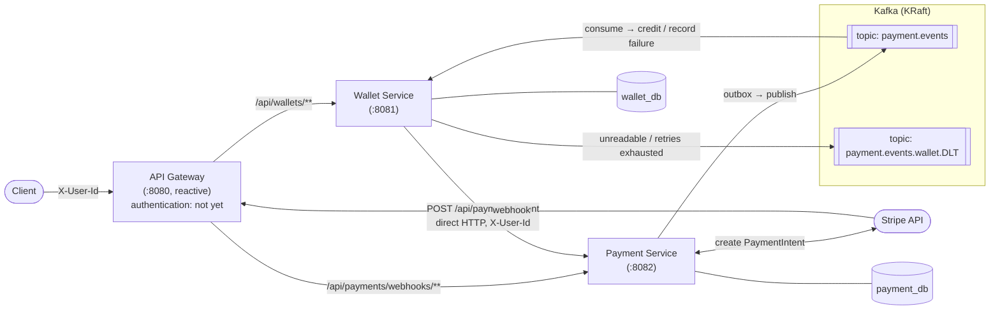

# FlowWallet architecture

This file explains how FlowWallet works: the module layout, the deposit flow, the transactional
outbox, the wallet's idempotent consumer, transfers between wallets, and the identity and security
model. For what the project is and its status, see [README.md](README.md); to run, configure and test it,
see [docs/development.md](docs/development.md). ADRs in
[docs/adr/](docs/adr/) record each design decision along with its rejected alternatives and
consequences.

**Reference**
- [API reference](docs/api.md)
- [Data model](docs/data-model.md)
- [Kafka topics & events](docs/events.md)

## Architecture

FlowWallet is a 5-module Maven reactor. A reactive API Gateway sits in front of two servlet-based domain
services. Wallet Service calls Payment Service over HTTP to start a deposit, directly rather than through
the gateway, and Payment Service reports the outcome back over Kafka. The gateway exposes all of Wallet
Service but only the webhook path of Payment Service.



- The API Gateway is a reactive Spring Cloud Gateway that routes by path only (no `StripPrefix`) and applies
  CORS globally. It sends `/api/wallets/**` to Wallet Service and only `/api/payments/webhooks/**` to
  Payment Service, so a payment can't be started from outside except through a wallet.
- Payment Service handles the Stripe integration, transaction persistence, webhooks and the outbox. It knows
  nothing about wallets: it takes an instruction and answers.
- Wallet Service owns wallets, balances and balance history (`wallet_db`) and serves `/api/wallets`. It
  starts a deposit by checking that the wallet exists and then asking Payment Service for a PaymentIntent.
  It consumes `payment.events`, crediting each completed payment exactly once and recording failed ones
  without moving money. A transfer between two wallets stays inside it: Payment Service and Kafka take no
  part.
- Platform holds shared servlet-side infrastructure built on Spring Web MVC: RFC 9457 error handling and the
  `@CurrentUserId` resolver (both auto-configured, servlet apps only), plus an `@Iso4217Currency`
  validation constraint.
- Contract holds the Kafka event payloads, the `payment.events` topic name, the `eventType` header name and
  its values, and the payload schema version. It declares no dependencies of its own and its code uses
  nothing outside the JDK, so it adds nothing to a consumer's classpath. The events are plain records, and a
  consumer brings its own serializer.
- Each service has its own database. `payment_db` and `wallet_db` are separate, and neither service touches
  the other's.

## Modules

```
flow-wallet (parent POM)
├── flow-wallet-platform   error handling, @CurrentUserId, ISO 4217 validation, transport constants
├── flow-wallet-contract   Kafka events, topic, eventType header — nothing beyond the JDK
├── flow-wallet-gateway    API Gateway (reactive) — routing + CORS
├── flow-wallet-service    Wallet Service — wallets, deposits, transfers, balance history, payment-event consumer
└── flow-wallet-payment    Payment Service — Stripe, transactions, webhooks, outbox
```

Platform and contract are separate modules because they follow different rules. Platform is ordinary shared
code, changed as freely as anything else. Contract is the boundary between services. Producer and consumer
are deployed separately, so a topic always holds messages written by more than one version of the code, and
changes there follow evolution rules: add optional fields only, never rename or retype, keep enums off the
wire. A DTO that belongs to one service lives in that service. The module split is explained in
[ADR 0002](docs/adr/0002-module-boundaries.md) and the contract rules in
[ADR 0009](docs/adr/0009-payment-event-contract.md).

| Module | Port | Responsibility |
|--------|------|----------------|
| `flow-wallet-gateway` | 8080 | Route `/api/wallets/**` to Wallet Service and only `/api/payments/webhooks/**` to Payment Service; CORS. |
| `flow-wallet-service` | 8081 | List, open and read wallets; cursor-paged balance history; deposit initiation (calls Payment Service over HTTP); transfers between two users' wallets in one currency; Kafka consumer that credits balances idempotently, with a dead-letter topic. |
| `flow-wallet-payment` | 8082 | Payment intents (internal), Stripe webhooks, transactional outbox → Kafka. |
| `flow-wallet-platform` | (library) | RFC 9457 error handling, `@CurrentUserId` auto-configuration, `@Iso4217Currency`, the `X-User-Id` header constant. |
| `flow-wallet-contract` | (library) | `PaymentCompletedEvent`, `PaymentFailedEvent`, the `payment.events` topic, the `eventType` header and its values. |

## Architecture decisions

Design decisions that span more than one file are written up as architecture decision records (ADRs) in
[`docs/adr/`](docs/adr/), one file per decision, each with its context, the alternatives that were rejected and
the consequences. [`docs/adr/README.md`](docs/adr/README.md) is the index. This file describes how the
system behaves and links the relevant ADR where a section needs the reasoning behind it.

## End-to-end deposit flow

A deposit starts with a synchronous request that hands the client a payment credential. The money moves
later, when the asynchronous confirmation arrives. Why a deposit starts in the wallet and is reserved before
Stripe is called is in [ADR 0013](docs/adr/0013-deposit-initiation.md).

```mermaid
sequenceDiagram
    autonumber
    participant C as Client
    participant G as Gateway
    participant W as Wallet Service
    participant P as Payment Service
    participant DB as payment_db
    participant S as Stripe
    participant K as Kafka
    participant WDB as wallet_db

    C->>G: POST /api/wallets/{currency}/deposits {amount} (X-User-Id, Idempotency-Key)
    G->>W: proxy
    W->>W: find wallet (userId, currency) — 404 if none, nothing charged
    W->>P: POST /api/payments/intent (internal; transactionReference = Idempotency-Key)
    P->>DB: save PaymentTransaction (PENDING)
    P->>S: create PaymentIntent (idempotency key = reference)
    S-->>P: paymentIntentId + client_secret
    P->>DB: save provider metadata
    P-->>W: providerData {clientSecret}, paymentIntentId, transactionReference
    W-->>C: 200 {reference, provider, providerData {clientSecret}}

    Note over C,S: Client confirms the payment with Stripe using clientSecret

    S->>G: POST /api/payments/webhooks/stripe (signed)
    G->>P: proxy
    P->>P: verify signature, dedupe on provider_event_id
    alt payment_intent.succeeded
      P->>DB: mark tx SUCCESS + insert OutboxEvent (same TX)
      P->>K: publish PaymentCompletedEvent (outbox)
      K-->>W: PaymentCompletedEvent
      W->>WDB: barrier row + lock & credit wallet + ledger entry (one TX)
    else payment_intent.payment_failed (PENDING tx only)
      P->>DB: mark tx FAILED + insert OutboxEvent (same TX)
      P->>K: publish PaymentFailedEvent (outbox)
      K-->>W: record the failure, balance unchanged
    end
```

## The Transactional Outbox

Payment Service never publishes to Kafka straight from business logic. In the same database transaction
that changes a transaction's status, it also writes a row to `outbox_events`, so the event exists if and
only if the state change commits. The reasoning is in [ADR 0008](docs/adr/0008-transactional-outbox.md).

Delivery to Kafka goes two ways:

1. The fast path is an `@Async @TransactionalEventListener(AFTER_COMMIT)` that sends the event as soon as the writing transaction commits.
2. The fallback path is a `@Scheduled` poller (every 10s) that picks up any `PENDING` rows the fast path missed, for example after a crash.

How it stays reliable:

- A sender claims a row with an atomic compare-and-swap, `UPDATE ... SET PROCESSING WHERE id=? AND status=PENDING`, without row locks.
- A failed send increments a retry counter and backs off exponentially through `next_attempt_at`. After `max-retries` the row becomes `FAILED`.
- Rows stuck in `PROCESSING` are recovered at runtime. A scheduled reaper returns anything older than a
  threshold to `PENDING`, and the threshold sits well above the longest plausible send, because a shorter
  one could reset a row that a live instance is still publishing.
- On startup the service also returns every `PROCESSING` row to `PENDING`, with no age threshold, so rows a
  crashed sender left behind go out immediately instead of waiting for the reaper. With several instances
  (a rolling deploy overlaps old and new), a starting instance can reset a row another instance is still
  sending, and that event reaches Kafka twice. This is accepted on purpose: both copies carry the same
  `eventId`, and the wallet's barrier discards the second.
- A failing row is skipped so it doesn't block the batch. Messages are keyed by `transactionReference`, but
  the outbox does not guarantee per-key send order. While an earlier event waits out its backoff, a later
  event for the same reference can be published first, such as a `PaymentCompleted` after a `PaymentFailed`
  (a failed payment can still succeed). The wallet doesn't depend on order, because a failure moves no money.
- `FAILED` rows are the durable dead-letter store and are never deleted automatically. A `FAILED` row is an
  event that never reached Kafka, which for a completed payment means a credit that never happened, and the
  row is the only record of it. `GET http://localhost:8082/actuator/outbox` returns `{"failed": n}`, and a
  `POST` to the same URL returns every `FAILED` row to `PENDING` (with retry count and backoff reset) and
  answers `{"requeued": n}`. The endpoint lives on Payment Service's own port and isn't exposed through the
  gateway. Alert on the `outbox.events.failed` gauge.
- A nightly cron (`OUTBOX_CLEANUP_CRON`, default 03:00) deletes `COMPLETED` rows older than
  `OUTBOX_RETENTION_DAYS` (default 7).

> Delivery is at-least-once. A crash after a successful Kafka send but before the row is marked
> `COMPLETED` causes a re-send on recovery, so any consumer must be idempotent. The next section is about
> how the wallet manages that.

## The wallet consumer

Wallet Service consumes `payment.events` and has to credit each completed payment exactly once, even though
Kafka delivers at least once. Two independent barriers make that hold. For a credit, both are written in the
same database transaction as the balance change: the `processed_events` row goes in first, then the
transaction locks the wallet row before it touches the balance and writes the ledger entry. A failed payment
writes only its `processed_events` row and takes no lock, because no money moves.

- Every event the listener settles (credited, failure recorded or refused) writes a `processed_events` row
  with a unique `event_id`. A redelivery hits that constraint and is acknowledged without touching the
  balance, and that includes redelivering an event the wallet already refused.
- A credit writes a `balance_history` row that is unique on (`transaction_reference`, `type`). A second,
  different event for a payment that was already credited is refused as `DUPLICATE_REFERENCE`, because that
  is a producer contract violation rather than an ordinary redelivery.

After a constraint violation the listener asks the database, from a fresh transaction, which barrier fired.
If neither did, it rethrows instead of guessing, so a real failure is never acknowledged as a duplicate.

The listener reads the event type from the Kafka `eventType` header and never infers it from the JSON.

| Event | Outcome |
|-------|---------|
| `PaymentCompletedEvent` for an existing wallet | Credited: balance updated, `DEPOSIT` ledger entry, `processed_events` row `CREDITED` |
| `PaymentFailedEvent` | Recorded as `FAILURE_RECORDED`; the balance never moves |
| Readable but refused (invalid amount or envelope, no wallet for that user and currency, a second event for a credited reference) | Stored as `REJECTED` with the reason and the full payload so it can be replayed; the offset is committed |
| Unreadable (missing or unknown `eventType` header, unparseable JSON, no `eventId`) | Sent to `payment.events.wallet.DLT` immediately, without retrying |
| Anything else that fails | Retried with exponential backoff, then sent to `payment.events.wallet.DLT` |

An event never creates a wallet. A deposit can only start through an existing wallet, so an event for a
missing wallet means a payment got in some other way, and it gets recorded instead of absorbed. Nothing
replays `REJECTED` rows automatically yet; replay is manual. The consumer's design is in
[ADR 0010](docs/adr/0010-idempotent-payment-event-consumer.md).

## Transfers between wallets

A transfer moves money from the caller's wallet to another user's wallet in the same currency. It is one
local transaction in `wallet_db`: the debit, the credit and both ledger entries commit together or not at
all. Payment Service and Kafka take no part, so there is no intermediate state to compensate for. The
reasoning behind the order below is in [ADR 0014](docs/adr/0014-transfers-in-one-local-transaction.md).

`TransferService` first settles what the request alone can settle, before it takes a database connection:
the currency, the amount's precision and a transfer to oneself. The money then moves in
`TransferHandler.execute`, a transaction pinned to READ COMMITTED, in this order:

1. It locks both wallet rows, the lower user id first. Transfers between two users take their locks in the
   same order whichever way the money goes, so a transfer from A to B and one from B to A can't each hold
   one row and wait for the other. The order is known from the request, so nothing is read before the locks.
2. If the caller holds no wallet in the currency, the answer is `404`.
3. It judges the `Idempotency-Key` by looking up the `TRANSFER_OUT` entry stored under it. The same transfer
   from the same wallet gets the original receipt back, and any other transfer under that key gets `409`.
   The lookup runs under the sender's lock, so a second request with the same key from the same wallet
   waits for the first and sees what it committed. It also runs before the funds check, so a retry of a
   transfer that spent the whole balance still gets its receipt rather than a `422`.
4. It debits the caller's wallet, or refuses with `422` if the balance is below the amount.
5. If the recipient holds no wallet in the currency, the answer is `422`. Funds are checked first, so only a
   request the caller can afford learns that a wallet is missing. A transfer never creates a wallet.
6. It credits the recipient's wallet and writes the two ledger entries under the lower-cased key:
   `TRANSFER_OUT` on the sender's wallet and `TRANSFER_IN` on the recipient's. Each entry names the user on
   the other side.

A balance never goes below zero. `Wallet.debit` refuses an overdraft before anything is written, and a CHECK
on `wallets.balance` holds the same rule for any code path that skips it.

Two requests with one key from different sender wallets need not share a lock. If their transfers share a
wallet, such as the recipient, they run one after the other on its lock, and the second one's key lookup
sees the first one's `TRANSFER_OUT` if it committed, so the answer is `409`. If they share no wallet, the
ledger's unique (`transaction_reference`, `type`) index decides between them: the second `TRANSFER_OUT`
insert waits for the first transaction and fails if that one commits. `TransferService` then reads the
ledger again after the rollback ([ADR 0007](docs/adr/0007-unique-constraints-decide.md)). A `TRANSFER_OUT`
under the key from another wallet gives `409`. The caller's own identical transfer gives the replay instead,
because a `409` would send the client to a new key and move the money twice. No `TRANSFER_OUT` under the key
means either a CHECK fired (the code let through something it should have refused) or a value overflowed its
column, such as a recipient's balance growing past what `NUMERIC(19,4)` holds. That violation is rethrown as
a `500` with its stack trace in the log and is never reported as a conflict or a success. The log names the
constraint but not the refused row, because the wallet's datasource turns off the Postgres driver's error
detail, which would print the row with its balances.

The lock order should rule out deadlocks, and while the row lock is held the wallet's `@Version` check has
nothing to catch. If a deadlock, a lock wait that timed out or a version conflict happens anyway, nothing
has committed, and the answer is `503` asking for a retry with the same key. No lock timeout is set. A
transfer waits as long as another transaction holds one of its rows, and every transaction in the service
that holds a wallet row does only database work. The locking rules are in
[ADR 0011](docs/adr/0011-wallet-row-locking.md).

## Identity & security model

- User identity travels between services in the `X-User-Id` HTTP header and reaches controllers through the
  `@CurrentUserId` argument resolver, which `flow-wallet-platform` registers for servlet services.
- Authentication isn't implemented yet. The plan is for the API gateway to authenticate the caller (with
  Spring Security) and set `X-User-Id`, and the services trust that header. Nothing validates a token today.
- That makes the network the trust boundary. The wallet and payment services read the header, the gateway
  doesn't, so the header must only be able to come from trusted parties. The gateway should be reachable
  only through authentication, Wallet Service only from the gateway, and Payment Service only from the
  gateway (for Stripe webhooks) and from Wallet Service (which forwards `X-User-Id` when it starts a
  payment). In a cluster, neither service gets a public route.
- `X-User-Id` must be a random-based UUID, version 4 or 7, and the resolver enforces it. An identity has to
  be opaque, so versions 1, 3 and 5 are refused even though they pass a naive UUID check. Versions 3 and 5
  are hashes of a name, so anyone who guesses the name can compute the id, and version 1 embeds a MAC
  address and a creation time. While the header is unauthenticated, whoever writes it becomes that user
  ([ADR 0003](docs/adr/0003-caller-identity-and-trust-boundary.md)).
- Anything else gets a `401`, the same as a missing header: a blank value, a non-UUID, a UUID of version 1, 3
  or 5, or anything longer than 64 characters. Surrounding whitespace is stripped and the value is folded to
  lower case, so one identity can't turn into two users with two balances.
- While `X-User-Id` is unauthenticated, it is the only credential. Transfers move money out of a wallet, so
  anyone who can reach Wallet Service and knows a user's id can spend that user's balance. Every transfer
  also hands its recipient the sender's id. The network boundary described above is what is meant to prevent
  this, and nothing enforces it yet.
- There is no way to search for users, by design. A transfer names its recipient by user id, and you know
  someone's id because they shared it with you.
- Each side of a transfer sees the other's user id. The recipient's `TRANSFER_IN` entry shows the sender's id
  and the sender's `Idempotency-Key`. Neither side sees the other's balance or other wallets. Because the
  recipient sees the key, transfer keys should be random (UUID version 4 or 7). A key derived from something
  guessable lets the recipient predict the sender's next key and use it first. That never moves money twice,
  but the sender's transfer then gets a `409`.
- A sender can learn little about a recipient. A `to` that isn't a version 4 or 7 UUID gets a `400` before any
  query. Funds are checked before the recipient, so only a request the sender can afford gets "The recipient
  holds no USD wallet". The wallet keeps no user registry, so a user without a wallet and an id that belongs
  to nobody get that same answer. Confirming that a wallet exists takes a completed transfer, which moves
  money and leaves the sender's id in the recipient's history. Each refused recipient is logged at WARN with
  both user ids ([ADR 0014](docs/adr/0014-transfers-in-one-local-transaction.md)).
- Stripe webhooks are verified cryptographically (HMAC signature with a replay window). That check doesn't
  depend on user identity and stays enforced.
