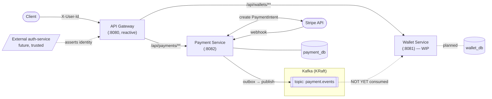
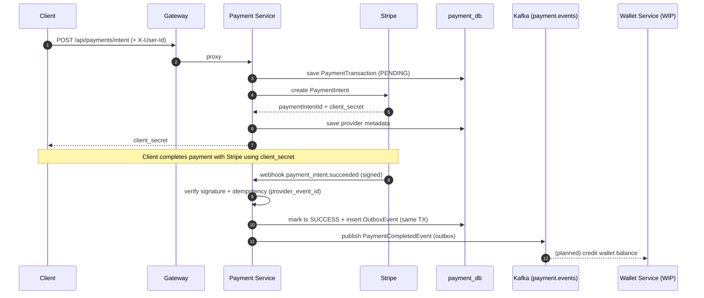

# FlowWallet


-231f20)


> **Event-driven microservices wallet system — an engineering showcase.**

FlowWallet is a backend platform that lets a user **top up a digital wallet** through an external
payment provider (Stripe) and have the balance credited **reliably and asynchronously** via events.
It is deliberately built to demonstrate production-grade patterns on a modern stack: a **Transactional
Outbox** for exactly-the-event-you-committed delivery, a **pluggable payment-provider abstraction**
(Strategy + Factory), **database-per-service** isolation, and clean module boundaries.

> ⚠️ **Project status:** This repository is a **work in progress**. The *payment* side of the system
> (request → Stripe → webhook → outbox → Kafka) is implemented and reasonably hardened. The *wallet*
> side (the Kafka consumer that actually credits balances, plus the wallet HTTP API) is **not yet
> implemented** — `flow-wallet-service` is currently a skeleton, so a top-up reaches Stripe and lands in
> Kafka, but no balance changes. Closing that loop is the MVP, and it is what the roadmap is organised
> around. See [`implementation_plan.md`](implementation_plan.md) (local file) for stages and progress.

---

## Table of contents

- [Architecture](#architecture)
- [End-to-end payment flow](#end-to-end-payment-flow)
- [Tech stack](#tech-stack)
- [Modules](#modules)
- [The Transactional Outbox](#the-transactional-outbox)
- [Data model](#data-model)
- [Kafka topics & events](#kafka-topics--events)
- [Identity & security model](#identity--security-model)
- [API reference](#api-reference)
- [Error responses](#error-responses)
- [Testing](#testing)
- [Getting started](#getting-started)
- [Configuration](#configuration)
- [Project status & roadmap](#project-status--roadmap)

---

## Architecture

FlowWallet is a **5-module Maven reactor**. A reactive API Gateway fronts two servlet-based domain
services, which communicate asynchronously over Kafka. Two dependency-free library modules sit under
them: one for cross-cutting infrastructure, one for the published contract.



Key characteristics:

- **API Gateway** — reactive Spring Cloud Gateway; pure path-based routing (no `StripPrefix`), global CORS.
- **Payment Service** — the core: Stripe integration, transaction persistence, webhook handling, and the outbox.
- **Wallet Service** — intended owner of balances & history and the consumer of payment events (skeleton today).
- **Platform** — cross-cutting infrastructure every service needs: RFC 9457 error handling and the
  `@CurrentUserId` resolver, both auto-configured.
- **Contract** — the Kafka event payloads and topic names, and nothing else. It declares **no
  dependencies at all**: the events are plain records and a consumer brings its own serializer.
- **Database-per-service** — `payment_db` and `wallet_db` are separate schemas; no cross-service DB access.

## End-to-end payment flow

The money-movement path is split into a synchronous request and an asynchronous confirmation.



## Tech stack

| Area | Technology |
|------|------------|
| Language | Java 25 |
| Framework | Spring Boot 4.1.0, Spring Cloud 2025.1.0 |
| Gateway | Spring Cloud Gateway (reactive / WebFlux) |
| Web / persistence | Spring MVC, Spring Data JPA, Hibernate |
| Database | PostgreSQL 17, HikariCP, Liquibase migrations |
| Messaging | Apache Kafka 4.2.1 (KRaft mode, no ZooKeeper) |
| Payments | Stripe (`stripe-java` 33.1.0) |
| JSON | Jackson 3 (`tools.jackson`) |
| Mapping | MapStruct 1.6.3 + Lombok |
| Resilience | Spring Retry |
| Build & infra | Maven multi-module, Docker Compose |

## Modules

```
flow-wallet (parent POM)
├── flow-wallet-platform   error handling, @CurrentUserId, transport constants
├── flow-wallet-contract   Kafka events + topic names — no dependencies
├── flow-wallet-gateway    API Gateway (reactive) — routing + CORS
├── flow-wallet-service    Wallet Service — balances, history, event consumer  [SKELETON]
└── flow-wallet-payment    Payment Service — Stripe, transactions, webhooks, outbox  [CORE]
```

**Why two library modules instead of one.** They serve different purposes and need different rules.
Platform is ordinary shared code, changed as freely as anything else. Contract is the boundary between
services: producer and consumer are deployed separately, so a topic always holds messages written by
more than one version of the code, and changes there follow evolution rules — add optional fields only,
never rename or retype, keep enums off the wire. One module could not express both sets of rules, so it
ended up with the loosest ones that fit either. A DTO belonging to a single service now has nowhere to
land except that service.

| Module | Port | State | Responsibility |
|--------|------|-------|----------------|
| `flow-wallet-gateway` | 8080 | Minimal | Route `/api/wallets/**` and `/api/payments/**`; CORS. |
| `flow-wallet-service` | 8081 | **Skeleton** | (Planned) wallet CRUD, top-up initiation, balance history, Kafka consumer. |
| `flow-wallet-payment` | 8082 | Implemented | Payment intents, Stripe webhooks, transactional outbox → Kafka. |
| `flow-wallet-platform` | —   | Implemented | RFC 9457 error handling, `@CurrentUserId` auto-configuration. |
| `flow-wallet-contract` | —   | Implemented | `PaymentCompletedEvent`, `PaymentFailedEvent`, topic names. |

## The Transactional Outbox

The Payment Service never publishes to Kafka directly from business logic. Instead, within the **same
database transaction** that changes a transaction's status, it also writes a row to `outbox_events`.
This guarantees the event exists **if and only if** the state change commits.

Delivery to Kafka uses a **dual dispatch** strategy:

1. **Fast path** — an `@Async @TransactionalEventListener(AFTER_COMMIT)` sends the event immediately once the writing transaction commits.
2. **Fallback path** — a `@Scheduled` poller (every 10s) picks up any `PENDING` rows the fast path missed (e.g. after a crash).

Reliability details:
- Ownership is claimed with an atomic compare-and-swap `UPDATE ... SET PROCESSING WHERE id=? AND status=PENDING` (no row locks).
- Failed sends increment a retry counter and back off exponentially through `next_attempt_at`, flipping to `FAILED` after `max-retries`.
- Rows stuck in `PROCESSING` are recovered **at runtime**, not only at startup: a scheduled reaper returns
  anything older than a threshold to `PENDING`. The threshold is deliberately well above the longest
  plausible send — a shorter one could reset a row a live instance is still publishing.
- A failing row is skipped rather than blocking the batch. Kafka messages are keyed by
  `transactionReference`, so ordering only has to hold per key, not globally.
- `FAILED` rows are a durable dead-letter store in their own right: they are visible through the
  `outbox.events.failed` gauge and can be requeued via `/actuator/outbox`. The usual cause of a failed
  send is an unreachable broker — exactly when publishing to a Kafka DLT would fail too.
- A nightly cron purges old `COMPLETED`/`FAILED` rows after a retention window.

> **Delivery semantics: at-least-once.** A crash after a successful Kafka send but before the row is
> marked `COMPLETED` will cause a re-send on recovery. **Any consumer must be idempotent.**

## Data model

**`payment_db`** (managed by Liquibase):

- **`payment_transactions`** — `id`, `transaction_reference` (unique idempotency key), `provider_name`,
  `provider_transaction_id` (unique), `wallet_id`, `user_id`, `amount NUMERIC(19,4)`, `currency`,
  `status` (`PENDING`/`SUCCESS`/`FAILED`), `provider_event_id` (unique), `version` (optimistic lock),
  `provider_metadata JSONB`, timestamps.
- **`outbox_events`** — `id`, `aggregate_type`, `aggregate_id`, `event_type`, `payload TEXT`,
  `status`, `retry_count`, `error_message`, `next_attempt_at` (backoff), `processing_started_at`
  (stuck-row detection), `created_at`, `processed_at`.

**`wallet_db`** — created by the Docker init script, currently **empty** (no wallet schema yet).

## Kafka topics & events

| Topic | Partitions | Producer | Consumer |
|-------|-----------|----------|----------|
| `payment.events` | 3 | Payment Service (via outbox) | Wallet Service *(planned — not implemented)* |
| `payment.events.DLT` | — | *declared as a constant, not yet wired* | — |

Events (published as JSON, keyed by `transactionReference`):

- **`PaymentCompletedEvent`** — `transactionReference`, `providerTransactionId`, `amount`, `currency`, `walletId`, `userId`, `completedAt`.
- **`PaymentFailedEvent`** — `transactionReference`, `providerTransactionId`, `walletId`, `userId`, `reason`, `failedAt`.

## Identity & security model

- User identity is carried between services in the **`X-User-Id`** HTTP header and injected into
  controllers via the `@CurrentUserId` argument resolver (auto-registered for servlet services through
  `flow-wallet-platform`).
- **Authentication is intentionally out of scope for this repository.** In the target deployment an
  **external, trusted `auth-service`** authenticates the caller and asserts `X-User-Id`. FlowWallet
  services **trust** that header. There is deliberately **no JWT validation** here.
- Practical consequence: the trust boundary lives at the edge in front of the gateway. When the
  auth-service is introduced, the network topology must ensure `X-User-Id` can only originate from it
  (e.g. the gateway is not publicly reachable except via the auth-service).
- Stripe webhooks **are** cryptographically verified (HMAC signature with a replay window) — this is
  independent of user identity and remains enforced.

## API reference

Base URL through the gateway: `http://localhost:8080`

### Payment Service

**Create a payment intent (top-up)**

```
POST /api/payments/intent
Header: X-User-Id: <user-id>
Content-Type: application/json

{
  "transactionReference": "unique-ref-123",
  "amount": 50.00,
  "currency": "USD",
  "walletId": 1,
  "providerName": "STRIPE"
}
```

Returns provider data (`clientSecret` for Stripe), the provider payment-intent id, and the transaction reference.
Amounts are validated to be between `1.00` and `10000.00`.

**Provider webhook**

```
POST /api/payments/webhooks/{provider}      e.g. /api/payments/webhooks/stripe
```

Consumes the raw request body plus provider signature headers. Verifies the signature, updates the
transaction, and emits the corresponding event through the outbox. Returns `200 OK`.

### Wallet Service

*Planned — not yet implemented (see the roadmap).*

## Error responses

Every service returns errors as **RFC 9457** `application/problem+json`, produced by a shared handler
in `flow-wallet-platform` so the contract is identical across services:

```json
{
  "type": "about:blank",
  "title": "Bad Request",
  "status": 400,
  "detail": "amount must be greater than or equal to 1.00",
  "instance": "/api/payments/intent",
  "timestamp": "2026-07-25T10:15:30.123Z"
}
```

Request-body validation failures additionally carry an `errors` array of field messages. Status mapping
is centralized: missing `X-User-Id` → `401`, invalid request / unknown provider → `400`, transaction not
found → `404`, upstream payment-provider failure → `502`, anything unexpected → `500` (with a generic
detail; internal specifics are logged, never returned).

## Testing

**54 tests**, all green: 50 in the payment service, 4 in platform. They cover the parts most likely to
be wrong rather than the parts easiest to reach — the asymmetric webhook state machine (a later failure
must not undo an earlier success, but a later success *must* override an earlier failure), outbox
claim/retry/backoff boundaries, Stripe signature parsing, and the RFC 9457 status mapping.

```bash
./mvnw test
```

The wallet consumer is untested for the honest reason that it does not exist yet. Its idempotency is the
riskiest logic in the system, so it lands together with an integration test that proves a redelivered
event does not credit twice.

## Getting started

### Prerequisites

- **JDK 25** (e.g. Amazon Corretto 25)
- **Maven** — optional; the repo ships the `./mvnw` wrapper, so no local Maven is required
- **Docker + Docker Compose**
- A **Stripe** account for real payments (test keys work out of the box for local dev)

### 1. Configure environment

Copy the committed template and fill in your values (the real `.env` is git-ignored):

```bash
cp .env.example .env
```

At minimum set your Stripe test keys (`STRIPE_API_KEY`, `STRIPE_WEBHOOK_SECRET`); everything else has a
working local default. Both Docker Compose and the services read the **same** `POSTGRES_USER` /
`POSTGRES_PASSWORD`, so the database credentials have a single source of truth.

### 2. Start infrastructure

```bash
docker compose up -d
```

This starts PostgreSQL 17 (creating `wallet_db` and `payment_db`), a single-node Kafka broker (KRaft),
and Kafka-UI at `http://localhost:8090`.

### 3. Build

```bash
./mvnw clean install
```

### 4. Run the services

Each service is a standalone Spring Boot app (there are no service Dockerfiles yet). In separate terminals:

```bash
./mvnw -pl flow-wallet-gateway spring-boot:run
```

```bash
./mvnw -pl flow-wallet-payment spring-boot:run
```

### 5. Forward Stripe webhooks (local dev)

```bash
stripe listen --forward-to localhost:8080/api/payments/webhooks/stripe
```

## Configuration

All settings are environment-overridable. Highlights:

| Variable | Default | Used by |
|----------|---------|---------|
| `GATEWAY_PORT` | `8080` | Gateway |
| `WALLET_SERVICE_PORT` | `8081` | Gateway (routing target only; the wallet service currently hardcodes `8081`) |
| `PAYMENT_SERVICE_PORT` | `8082` | Gateway routing / Payment |
| `DB_HOST` / `DB_PORT` | `localhost` / `5432` | Payment |
| `POSTGRES_USER` / `POSTGRES_PASSWORD` | `flowadmin` / `flowsecret` | Payment **and** Docker Compose (single source) |
| `DB_POOL_MAX_SIZE` / `DB_POOL_MIN_IDLE` | `10` / `2` | Payment |
| `KAFKA_BOOTSTRAP_SERVERS` | `localhost:9092` | Payment |
| `KAFKA_TOPIC_PAYMENT_EVENTS_PARTITIONS` | `3` | Payment |
| `STRIPE_API_KEY` | `sk_test_dummy` | Payment |
| `STRIPE_WEBHOOK_SECRET` | `whsec_dummy` | Payment |
| `OUTBOX_POLL_INTERVAL_MS` | `10000` | Payment |
| `OUTBOX_BATCH_SIZE` | `50` | Payment |
| `OUTBOX_MAX_RETRIES` | `3` | Payment |
| `OUTBOX_RETENTION_DAYS` | `7` | Payment |
| `LOG_LEVEL` / `APP_LOG_LEVEL` | `INFO` / `DEBUG` | Payment (only its `application.yml` wires these) |

## Project status & roadmap

This is an actively evolving showcase. The payment side is done and hardened; what remains before the
system does its actual job is the wallet side.

The roadmap is organised around one sentence — *a user creates a wallet, tops it up, and sees the balance
grow* — and everything not needed for it is deferred:

1. **Wallet comes alive** — enable its infrastructure, add the domain model and migrations, write the
   idempotent Kafka consumer and its dead-letter handling.
2. **The client drives the wallet** — wallet endpoints and top-up initiation.
3. **Proof that it works** — the integration tests that make "it works" a fact rather than an assumption.

Then a 1.0 tag. Stages, definitions of done and open decisions live in `implementation_plan.md`, which is
a local working file and deliberately not committed.
