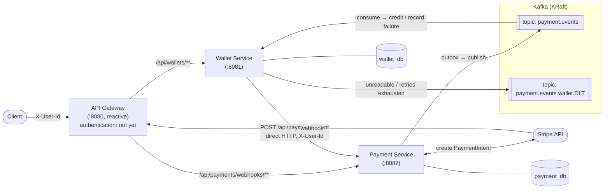

# FlowWallet


-231f20)


> **Event-driven microservices wallet system, built as an engineering showcase.**

FlowWallet is a backend platform that lets a user deposit into a digital wallet through an external
payment provider (Stripe), have the balance credited reliably and asynchronously through events, and send
money to another user's wallet in the same currency. It is built to demonstrate production-grade patterns on
a modern stack: a Transactional Outbox, so an event is published if and only if the change behind it
commits; an idempotent event consumer that credits a balance once however often an event arrives; a
pluggable payment-provider abstraction (Strategy + Factory); database-per-service isolation; and clean
module boundaries.

> **Project status:** work in progress. The deposit loop works end to end. A client asks its wallet to
> start a deposit, the wallet checks that the wallet exists and belongs to the caller, Payment Service
> creates a Stripe PaymentIntent, a signed webhook confirms the payment, the outbox publishes to Kafka, and
> the wallet credits the balance exactly once. A user can also send money to another user's wallet in the
> same currency, in one local transaction inside Wallet Service. Integration tests against real Postgres and
> Kafka, and withdrawals, are still to come. See [Project status & roadmap](#project-status--roadmap).
>
> The project runs against Stripe test mode only and is not meant for production use.

---

## Table of contents

- [How it works](#how-it-works)
- [Documentation](#documentation)
- [Tech stack](#tech-stack)
- [Quickstart](#quickstart)
- [Project status & roadmap](#project-status--roadmap)

---

## How it works

FlowWallet runs as five Maven modules. A reactive API gateway sits in front of two servlet-based domain
services, and each service keeps its own Postgres database. Wallet Service calls Payment Service directly
over HTTP to start a deposit, and Payment Service reports the outcome back through Kafka once Stripe
confirms the payment.


```mermaid
flowchart LR
    Client([Client])
    GW["API Gateway<br/>(:8080, reactive)<br/>authentication: not yet"]
    WS["Wallet Service<br/>(:8081)"]
    PS["Payment Service<br/>(:8082)"]
    Stripe([Stripe API])
    subgraph Kafka["Kafka (KRaft)"]
      T[["topic: payment.events"]]
      DLT[["topic: payment.events.wallet.DLT"]]
    end
    WDB[("wallet_db")]
    PDB[("payment_db")]

    Client -->|X-User-Id| GW
    GW -->|/api/wallets/**| WS
    GW -->|/api/payments/webhooks/**| PS
    WS -->|POST /api/payments/intent<br/>direct HTTP, X-User-Id| PS
    PS <-->|create PaymentIntent| Stripe
    Stripe -->|webhook| GW
    PS -->|outbox → publish| T
    T -->|consume → credit / record failure| WS
    WS -->|unreadable / retries exhausted| DLT
    PS --- PDB
    WS --- WDB
```

See [ARCHITECTURE.md](ARCHITECTURE.md) for the module breakdown, the deposit and transfer flows, the outbox,
the wallet consumer and the identity model.

## Documentation

| Document | Answers |
|----------|---------|
| [ARCHITECTURE.md](ARCHITECTURE.md) | How the system works: the modules, the deposit flow, the outbox, the wallet consumer, transfers and the identity model |
| [docs/adr/](docs/adr/README.md) | Why: one decision record per file, with the alternatives that were rejected |
| [docs/api.md](docs/api.md) | The API reference and error responses |
| [docs/data-model.md](docs/data-model.md) | The database schema for each service |
| [docs/events.md](docs/events.md) | The Kafka topics and event contracts |
| [docs/development.md](docs/development.md) | How to run, configure and test the project |

## Tech stack

| Area | Technology |
|------|------------|
| Language | Java 25 |
| Framework | Spring Boot 4.1.0, Spring Cloud 2025.1.3 |
| Gateway | Spring Cloud Gateway (reactive / WebFlux) |
| Web / persistence | Spring MVC, Spring Data JPA, Hibernate |
| Service-to-service HTTP | Spring declarative HTTP interface (`@HttpExchange`) over `RestClient`, no Feign |
| Database | PostgreSQL 17, HikariCP, Liquibase migrations |
| Messaging | Apache Kafka 4.2.1 (KRaft mode, no ZooKeeper) |
| Payments | Stripe (`stripe-java` 33.1.0), test mode |
| JSON | Jackson 3 (`tools.jackson`) |
| Mapping | MapStruct 1.6.3 + Lombok |
| Resilience | Spring Retry (payment); Spring Kafka `DefaultErrorHandler` + dead-letter topic (wallet) |
| Build & infra | Maven multi-module, Docker Compose |

## Quickstart

JDK 25, Docker and Docker Compose, and a Stripe test-mode account with the [Stripe CLI](https://docs.stripe.com/cli/install)
are the only prerequisites. Maven is optional: `./mvnw` downloads it on first run.

Configure the environment:

```bash
cp .env.example .env
```

Set `STRIPE_API_KEY` and `POSTGRES_PASSWORD` in `.env`. Leave `STRIPE_WEBHOOK_SECRET` on its placeholder for
now; the next step gives you the real value.

Start infrastructure:

```bash
docker compose up -d
```

Build:

```bash
./mvnw clean install
```

Run all three services, each in its own terminal:

```bash
./mvnw -pl flow-wallet-gateway spring-boot:run
./mvnw -pl flow-wallet-payment spring-boot:run
./mvnw -pl flow-wallet-service spring-boot:run
```

Forward Stripe webhooks:

```bash
stripe listen --forward-to localhost:8080/api/payments/webhooks/stripe
```

`stripe listen` prints a webhook signing secret (`whsec_...`). Put it in `STRIPE_WEBHOOK_SECRET` and restart
Payment Service, or every webhook comes back `400` and nothing gets credited.

See [docs/development.md](docs/development.md) for the full guide, configuration and testing.

## Project status & roadmap

This is a showcase that keeps changing. The deposit loop works end to end, and transfers between wallets
work against real Postgres. What's left is automated tests on real infrastructure, and withdrawals.

1. ~~Wallet comes alive~~: done. Domain model and migrations, an idempotent Kafka consumer, and retries with
   backoff plus a dead-letter topic.
2. ~~The client drives the wallet~~: done. Wallet endpoints and deposits started through the wallet.
3. Proof that it works: integration tests against real Postgres and Kafka showing that a redelivery doesn't
   credit twice, a duplicate reference is refused, a poison record lands in the dead-letter topic, and a
   deposit raises the balance end to end. For transfers they should show that opposite transfers don't
   deadlock, that concurrent requests with one key move the money once, that a key raced from two senders
   goes to one of them whether or not the two transfers share a wallet, that concurrent transfers can't
   overdraw a wallet, and that a replay is byte for byte the first answer.
4. ~~Transfers between wallets~~: done, with their automated tests on real infrastructure left to stage 3.
   Same currency only, the recipient named by user id, and one local transaction that locks both wallets in
   ascending user id.
5. Withdrawals out to the payment provider, through Stripe Connect in test mode.

Stages, definitions of done and open decisions live in `implementation_plan.md`. It is a local working file
and deliberately isn't committed.
