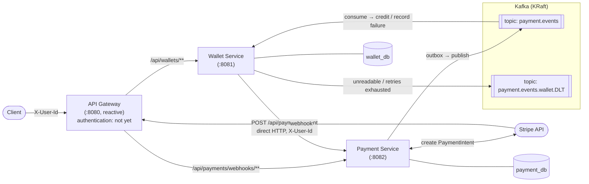

# FlowWallet


-231f20)


> **Event-driven microservices wallet system, built as an engineering showcase.**

FlowWallet is a backend platform that lets a user deposit into a digital wallet through an external
payment provider (Stripe) and have the balance credited reliably and asynchronously through events. It is
built to demonstrate production-grade patterns on a modern stack: a Transactional Outbox, so an event is
published if and only if the change behind it commits; an idempotent event consumer that credits a balance
once however often an event arrives; a pluggable payment-provider abstraction (Strategy + Factory);
database-per-service isolation; and clean module boundaries.

> **Project status:** work in progress. The deposit loop works end to end. A client asks its wallet to
> start a deposit, the wallet checks that the wallet exists and belongs to the caller, Payment Service
> creates a Stripe PaymentIntent, a signed webhook confirms the payment, the outbox publishes to Kafka, and
> the wallet credits the balance exactly once. Integration tests against real Postgres and Kafka, transfers
> between wallets and withdrawals are still to come. See [Project status & roadmap](#project-status--roadmap).
>
> The project runs against Stripe test mode only and is not meant for production use.

---

## Table of contents

- [Architecture](#architecture)
- [End-to-end deposit flow](#end-to-end-deposit-flow)
- [Tech stack](#tech-stack)
- [Modules](#modules)
- [The Transactional Outbox](#the-transactional-outbox)
- [The wallet consumer](#the-wallet-consumer)
- [Data model](#data-model)
- [Kafka topics & events](#kafka-topics--events)
- [Identity & security model](#identity--security-model)
- [API reference](#api-reference)
- [Error responses](#error-responses)
- [Testing](#testing)
- [Getting started](#getting-started)
- [Configuration](#configuration)
- [Project status & roadmap](#project-status--roadmap)

---

## Architecture

FlowWallet is a 5-module Maven reactor. A reactive API Gateway sits in front of two servlet-based domain
services. Wallet Service calls Payment Service over HTTP to start a deposit, directly rather than through
the gateway, and Payment Service reports the outcome back over Kafka. The gateway exposes all of Wallet
Service but only the webhook path of Payment Service.


```mermaid
flowchart LR
    Client([Client])
    GW["API Gateway<br/>(:8080, reactive)<br/>authentication: not yet"]
    WS["Wallet Service<br/>(:8081)"]
    PS["Payment Service<br/>(:8082)"]
    Stripe([Stripe API])
    subgraph Kafka["Kafka (KRaft)"]
      T[["topic: payment.events"]]
      DLT[["topic: payment.events.wallet.DLT"]]
    end
    WDB[("wallet_db")]
    PDB[("payment_db")]

    Client -->|X-User-Id| GW
    GW -->|/api/wallets/**| WS
    GW -->|/api/payments/webhooks/**| PS
    WS -->|POST /api/payments/intent<br/>direct HTTP, X-User-Id| PS
    PS <-->|create PaymentIntent| Stripe
    Stripe -->|webhook| GW
    PS -->|outbox → publish| T
    T -->|consume → credit / record failure| WS
    WS -->|unreadable / retries exhausted| DLT
    PS --- PDB
    WS --- WDB
```

- The API Gateway is a reactive Spring Cloud Gateway that routes by path only (no `StripPrefix`) and applies
  CORS globally. It sends `/api/wallets/**` to Wallet Service and only `/api/payments/webhooks/**` to
  Payment Service, so a payment can't be started from outside except through a wallet.
- Payment Service handles the Stripe integration, transaction persistence, webhooks and the outbox. It knows
  nothing about wallets: it takes an instruction and answers.
- Wallet Service owns wallets, balances and balance history (`wallet_db`) and serves `/api/wallets`. It
  starts a deposit by checking that the wallet exists and then asking Payment Service for a PaymentIntent.
  It consumes `payment.events`, crediting each completed payment exactly once and recording failed ones
  without moving money.
- Platform holds shared servlet-side infrastructure built on Spring Web MVC: RFC 9457 error handling and the
  `@CurrentUserId` resolver (both auto-configured, servlet apps only), plus an `@Iso4217Currency`
  validation constraint.
- Contract holds the Kafka event payloads, the `payment.events` topic name, the `eventType` header name and
  its values, and the payload schema version. It declares no dependencies of its own and its code uses
  nothing outside the JDK, so it adds nothing to a consumer's classpath. The events are plain records, and a
  consumer brings its own serializer.
- Each service has its own database. `payment_db` and `wallet_db` are separate, and neither service touches
  the other's.

## End-to-end deposit flow

A deposit starts with a synchronous request that hands the client a payment credential. The money moves
later, when the asynchronous confirmation arrives.

```mermaid
sequenceDiagram
    autonumber
    participant C as Client
    participant G as Gateway
    participant W as Wallet Service
    participant P as Payment Service
    participant DB as payment_db
    participant S as Stripe
    participant K as Kafka
    participant WDB as wallet_db

    C->>G: POST /api/wallets/{currency}/deposits {amount} (X-User-Id, Idempotency-Key)
    G->>W: proxy
    W->>W: find wallet (userId, currency) — 404 if none, nothing charged
    W->>P: POST /api/payments/intent (internal; transactionReference = Idempotency-Key)
    P->>DB: save PaymentTransaction (PENDING)
    P->>S: create PaymentIntent (idempotency key = reference)
    S-->>P: paymentIntentId + client_secret
    P->>DB: save provider metadata
    P-->>W: providerData {clientSecret}, paymentIntentId, transactionReference
    W-->>C: 200 {reference, provider, providerData {clientSecret}}

    Note over C,S: Client confirms the payment with Stripe using clientSecret

    S->>G: POST /api/payments/webhooks/stripe (signed)
    G->>P: proxy
    P->>P: verify signature, dedupe on provider_event_id
    alt payment_intent.succeeded
      P->>DB: mark tx SUCCESS + insert OutboxEvent (same TX)
      P->>K: publish PaymentCompletedEvent (outbox)
      K-->>W: PaymentCompletedEvent
      W->>WDB: barrier row + lock & credit wallet + ledger entry (one TX)
    else payment_intent.payment_failed (PENDING tx only)
      P->>DB: mark tx FAILED + insert OutboxEvent (same TX)
      P->>K: publish PaymentFailedEvent (outbox)
      K-->>W: record the failure, balance unchanged
    end
```

## Tech stack

| Area | Technology |
|------|------------|
| Language | Java 25 |
| Framework | Spring Boot 4.1.0, Spring Cloud 2025.1.3 |
| Gateway | Spring Cloud Gateway (reactive / WebFlux) |
| Web / persistence | Spring MVC, Spring Data JPA, Hibernate |
| Service-to-service HTTP | Spring declarative HTTP interface (`@HttpExchange`) over `RestClient`, no Feign |
| Database | PostgreSQL 17, HikariCP, Liquibase migrations |
| Messaging | Apache Kafka 4.2.1 (KRaft mode, no ZooKeeper) |
| Payments | Stripe (`stripe-java` 33.1.0), test mode |
| JSON | Jackson 3 (`tools.jackson`) |
| Mapping | MapStruct 1.6.3 + Lombok |
| Resilience | Spring Retry (payment); Spring Kafka `DefaultErrorHandler` + dead-letter topic (wallet) |
| Build & infra | Maven multi-module, Docker Compose |

## Modules

```
flow-wallet (parent POM)
├── flow-wallet-platform   error handling, @CurrentUserId, ISO 4217 validation, transport constants
├── flow-wallet-contract   Kafka events, topic, eventType header — nothing beyond the JDK
├── flow-wallet-gateway    API Gateway (reactive) — routing + CORS
├── flow-wallet-service    Wallet Service — wallets, deposits, balance history, payment-event consumer
└── flow-wallet-payment    Payment Service — Stripe, transactions, webhooks, outbox
```

There are two library modules instead of one because they serve different purposes and need different
rules. Platform is ordinary shared code, changed as freely as anything else. Contract is the boundary
between services. Producer and consumer are deployed separately, so a topic always holds messages written
by more than one version of the code, and changes there follow evolution rules: add optional fields only,
never rename or retype, keep enums off the wire. A single module could not express both sets of rules and
ended up with the loosest ones that fit either. Now a DTO that belongs to one service has nowhere to land
except that service.

| Module | Port | Responsibility |
|--------|------|----------------|
| `flow-wallet-gateway` | 8080 | Route `/api/wallets/**` to Wallet Service and only `/api/payments/webhooks/**` to Payment Service; CORS. |
| `flow-wallet-service` | 8081 | List, open and read wallets; cursor-paged balance history; deposit initiation (calls Payment Service over HTTP); Kafka consumer that credits balances idempotently, with a dead-letter topic. |
| `flow-wallet-payment` | 8082 | Payment intents (internal), Stripe webhooks, transactional outbox → Kafka. |
| `flow-wallet-platform` | (library) | RFC 9457 error handling, `@CurrentUserId` auto-configuration, `@Iso4217Currency`, the `X-User-Id` header constant. |
| `flow-wallet-contract` | (library) | `PaymentCompletedEvent`, `PaymentFailedEvent`, the `payment.events` topic, the `eventType` header and its values. |

## The Transactional Outbox

Payment Service never publishes to Kafka straight from business logic. In the same database transaction
that changes a transaction's status, it also writes a row to `outbox_events`, so the event exists if and
only if the state change commits.

Delivery to Kafka goes two ways:

1. The fast path is an `@Async @TransactionalEventListener(AFTER_COMMIT)` that sends the event as soon as the writing transaction commits.
2. The fallback path is a `@Scheduled` poller (every 10s) that picks up any `PENDING` rows the fast path missed, for example after a crash.

How it stays reliable:

- A sender claims a row with an atomic compare-and-swap, `UPDATE ... SET PROCESSING WHERE id=? AND status=PENDING`, without row locks.
- A failed send increments a retry counter and backs off exponentially through `next_attempt_at`. After `max-retries` the row becomes `FAILED`.
- Rows stuck in `PROCESSING` are recovered at runtime. A scheduled reaper returns anything older than a
  threshold to `PENDING`, and the threshold sits well above the longest plausible send, because a shorter
  one could reset a row that a live instance is still publishing.
- On startup the service also returns every `PROCESSING` row to `PENDING`, with no age threshold, so rows a
  crashed sender left behind go out immediately instead of waiting for the reaper. With several instances
  (a rolling deploy overlaps old and new), a starting instance can reset a row another instance is still
  sending, and that event reaches Kafka twice. This is accepted on purpose: both copies carry the same
  `eventId`, and the wallet's barrier discards the second.
- A failing row is skipped so it doesn't block the batch. Messages are keyed by `transactionReference`, but
  the outbox does not guarantee per-key send order. While an earlier event waits out its backoff, a later
  event for the same reference can be published first, such as a `PaymentCompleted` after a `PaymentFailed`
  (a failed payment can still succeed). The wallet doesn't depend on order, because a failure moves no money.
- `FAILED` rows are the durable dead-letter store and are never deleted automatically. A `FAILED` row is an
  event that never reached Kafka, which for a completed payment means a credit that never happened, and the
  row is the only record of it. `GET http://localhost:8082/actuator/outbox` returns `{"failed": n}`, and a
  `POST` to the same URL returns every `FAILED` row to `PENDING` (with retry count and backoff reset) and
  answers `{"requeued": n}`. The endpoint lives on Payment Service's own port and isn't exposed through the
  gateway. Alert on the `outbox.events.failed` gauge.
- A nightly cron (`OUTBOX_CLEANUP_CRON`, default 03:00) deletes `COMPLETED` rows older than
  `OUTBOX_RETENTION_DAYS` (default 7).

> Delivery is at-least-once. A crash after a successful Kafka send but before the row is marked
> `COMPLETED` causes a re-send on recovery, so any consumer must be idempotent. The next section is about
> how the wallet manages that.

## The wallet consumer

Wallet Service consumes `payment.events` and has to credit each completed payment exactly once, even though
Kafka delivers at least once. Two independent barriers make that hold. For a credit, both are written in the
same database transaction as the balance change: the `processed_events` row goes in first, then the
transaction locks the wallet row before it touches the balance and writes the ledger entry. A failed payment
writes only its `processed_events` row and takes no lock, because no money moves.

- Every event the listener settles (credited, failure recorded or refused) writes a `processed_events` row
  with a unique `event_id`. A redelivery hits that constraint and is acknowledged without touching the
  balance, and that includes redelivering an event the wallet already refused.
- A credit writes a `balance_history` row that is unique on (`transaction_reference`, `type`). A second,
  different event for a payment that was already credited is refused as `DUPLICATE_REFERENCE`, because that
  is a producer contract violation rather than an ordinary redelivery.

After a constraint violation the listener asks the database, from a fresh transaction, which barrier fired.
If neither did, it rethrows instead of guessing, so a real failure is never acknowledged as a duplicate.

The listener reads the event type from the Kafka `eventType` header and never infers it from the JSON.

| Event | Outcome |
|-------|---------|
| `PaymentCompletedEvent` for an existing wallet | Credited: balance updated, `DEPOSIT` ledger entry, `processed_events` row `CREDITED` |
| `PaymentFailedEvent` | Recorded as `FAILURE_RECORDED`; the balance never moves |
| Readable but refused (invalid amount or envelope, no wallet for that user and currency, a second event for a credited reference) | Stored as `REJECTED` with the reason and the full payload so it can be replayed; the offset is committed |
| Unreadable (missing or unknown `eventType` header, unparseable JSON, no `eventId`) | Sent to `payment.events.wallet.DLT` immediately, without retrying |
| Anything else that fails | Retried with exponential backoff, then sent to `payment.events.wallet.DLT` |

An event never creates a wallet. A deposit can only start through an existing wallet, so an event for a
missing wallet means a payment got in some other way, and it gets recorded instead of absorbed. Nothing
replays `REJECTED` rows automatically yet; replay is manual.

## Data model

`payment_db` is managed by Liquibase in `flow-wallet-payment`:

- `payment_transactions` holds `id`, `transaction_reference` (unique idempotency key), `provider_name`,
  `provider_transaction_id` (unique), `user_id`, `amount NUMERIC(19,4)`, `currency`,
  `status` (`PENDING`/`SUCCESS`/`FAILED`), `provider_event_id` (unique), `version` (optimistic lock),
  `provider_metadata JSONB` and timestamps.
- `outbox_events` holds `id`, `aggregate_type`, `aggregate_id`, `event_type`, `payload TEXT`, `status`,
  `retry_count`, `error_message`, `next_attempt_at` (backoff), `processing_started_at` (stuck-row
  detection), `created_at` and `processed_at`.

`wallet_db` is managed by Liquibase in `flow-wallet-service`:

- `wallets` holds `id`, `user_id VARCHAR(64)`, `balance NUMERIC(19,4)` (default 0), `currency VARCHAR(3)`
  (a CHECK forces upper case), `version` and timestamps. `version` is an optimistic-lock backstop, since
  credits take a `PESSIMISTIC_WRITE` row lock. The table is unique on (`user_id`, `currency`): one wallet per
  user per currency.
- `balance_history` is the append-only ledger: `id`, `wallet_id` (indexed), `transaction_reference`,
  `event_id` (nullable), `type`, `amount`, `balance_before`, `balance_after` and `created_at`. It is unique on
  (`transaction_reference`, `type`), so the two legs of a future transfer can share a reference while a
  payment can still be credited only once.
- `processed_events` holds one row per event the consumer settles (credited, failure recorded or refused).
  Unreadable records and records that still fail after retries go to the dead-letter topic and leave no row.
  Its columns are `id`, `event_id` (unique), `event_type`,
  `transaction_reference`, `amount`, `outcome` (`CREDITED`/`FAILURE_RECORDED`/`REJECTED`),
  `rejection_reason`, `payload TEXT` (kept for `FAILURE_RECORDED` and `REJECTED`, NULL for `CREDITED`) and
  `processed_at`. It is indexed on (`outcome`, `processed_at`).

`docker/postgres/init-databases.sql` creates both databases when the Postgres volume is first initialised.

## Kafka topics & events

| Topic | Partitions | Producer | Consumer |
|-------|-----------|----------|----------|
| `payment.events` | 3 | Payment Service (via outbox) | Wallet Service, group `flow-wallet-service` |
| `payment.events.wallet.DLT` | 3 | Wallet Service error handler | none; inspect or replay by hand |

Both topics are declared as beans (`payment.events` by Payment Service, the dead-letter topic by Wallet
Service), so they are created at startup with the configured partitions and replicas instead of relying on
broker auto-creation. Both producers use `acks=all` with idempotence enabled.

Payment Service has no dead-letter topic of its own. A send fails almost only when the broker is
unreachable, and that is exactly when publishing to another topic on the same broker would fail as well,
so the `FAILED` rows in `outbox_events` play that role. The wallet's dead-letter topic is something else:
it carries failed consumer records, not outbox rows.

Events are published as JSON strings keyed by `transactionReference`. Each record carries an `eventType`
header set to `PaymentCompletedEvent` or `PaymentFailedEvent`. Consumers dispatch on that header and treat a
record without it as unreadable. `schemaVersion` is currently `1`, and it only changes for a change that
can't be made additively.

- `PaymentCompletedEvent` carries `eventId`, `schemaVersion`, `transactionReference`, `providerTransactionId`, `amount`, `currency`, `userId`, `completedAt`.
- `PaymentFailedEvent` carries `eventId`, `schemaVersion`, `transactionReference`, `providerTransactionId`, `amount`, `currency`, `userId`, `reason`, `failedAt`.

Neither event names a wallet. A wallet is identified by its owner and its currency, and the events already
carry both, so a wallet id would be a second name for the same thing that nothing could check against the
first.

`reason` is a fixed description written by Payment Service, not the provider's decline message, so don't
branch on it. Consumers deduplicate on `eventId` and never on `transactionReference`. A `PaymentFailedEvent`
isn't terminal: the same reference can later get a `PaymentCompletedEvent` if the payment is retried and
succeeds. Payment Service never creates a failure after a success and emits at most one
`PaymentCompletedEvent` per reference, but since the outbox doesn't guarantee per-key send order, a consumer
can still receive a `PaymentFailedEvent` after the `PaymentCompletedEvent` for the same reference. The wallet
copes with either order, because a failure moves no money.

## Identity & security model

- User identity travels between services in the `X-User-Id` HTTP header and reaches controllers through the
  `@CurrentUserId` argument resolver, which `flow-wallet-platform` registers for servlet services.
- Authentication isn't implemented yet. The plan is for the API gateway to authenticate the caller (with
  Spring Security) and set `X-User-Id`, and the services trust that header. Nothing validates a token today.
- That makes the network the trust boundary. The wallet and payment services read the header, the gateway
  doesn't, so the header must only be able to come from trusted parties. The gateway should be reachable
  only through authentication, Wallet Service only from the gateway, and Payment Service only from the
  gateway (for Stripe webhooks) and from Wallet Service (which forwards `X-User-Id` when it starts a
  payment). In a cluster, neither service gets a public route.
- `X-User-Id` must be a random-based UUID, version 4 or 7, and the resolver enforces it. An identity has to
  be opaque and must not be derivable from anything knowable. Versions 1, 3 and 5 pass a naive UUID check
  and are refused anyway. Versions 3 and 5 are deterministic hashes of a name, so anyone who suspects an id
  is `uuid5(namespace, e-mail)` can compute it and confirm the guess, and version 1 embeds a MAC address and
  a creation time. Mostly this is data hygiene. Right now it matters more than that, because the header
  isn't authenticated and whoever writes it becomes that user.
- Anything else gets a `401`, the same as a missing header: a blank value, a non-UUID, a UUID of version 1, 3
  or 5, or anything longer than 64 characters. Surrounding whitespace is stripped and the value is folded to
  lower case, so one identity can't turn into two users with two balances.
- There is no way to search for users, by design. When transfers arrive they will name the recipient by id,
  and you know someone's id because they shared it with you.
- Stripe webhooks are verified cryptographically (HMAC signature with a replay window). That check doesn't
  depend on user identity and stays enforced.

## API reference

The base URL through the gateway is `http://localhost:8080`. Every wallet endpoint needs `X-User-Id`.

### Wallet Service

A wallet is addressed by its ISO 4217 currency and never by an id. A user holds at most one wallet per
currency, and `X-User-Id` already names the owner, so the pair identifies the wallet exactly. It also means
"not yours" and "does not exist" give the same result. Currency is case-insensitive in the path and in the
body.

| Method & path | Request | Response |
|---------------|---------|----------|
| `GET /api/wallets` | (none) | `200` `[{balance, currency, createdAt, updatedAt}]`, ordered by currency; an empty list if none, never `404` |
| `POST /api/wallets` | `{"currency": "USD"}` | `201` the wallet; `400` not an ISO 4217 code; `409` a wallet in that currency already exists |
| `GET /api/wallets/{currency}` | (none) | `200` the wallet; `400` invalid code; `404` the caller holds no such wallet (never `403`) |
| `GET /api/wallets/{currency}/history?before={id}&limit={n}` | (none) | `200` `{items, nextBefore}`, newest first |
| `POST /api/wallets/{currency}/deposits` | `{"amount": 50.00}` + `Idempotency-Key` header | `200` `{reference, provider, providerData}` |

History uses a cursor instead of an offset. The ledger only grows at its newest end, so a credit landing
between two page reads would shift every offset. Leave `before` out for the first page, then pass the
previous `nextBefore`, which is `null` once nothing older exists. `limit` is 1 to 100, default 20. An item
looks like `{id, transactionReference, type, amount, balanceBefore, balanceAfter, createdAt}`.

A deposit returns `200` rather than `201` or `202`. Nothing gets created on the wallet's side, and the client
finishes the work itself by confirming the payment with Stripe using `providerData.clientSecret`.

- `Idempotency-Key` is required and can be a UUID of any version, in either case. It is lower-cased and
  becomes the payment's transaction reference, so the same string runs from the client through Payment
  Service into Stripe, onto the event and into the ledger. The server never generates one. If it did, a lost
  response would get a fresh key on retry, and the customer would be charged twice.
- Repeating a request with the same key and the same amount returns a byte-identical body. Reusing a key
  with a different amount, or a key whose deposit already completed, gets a `409`.
- The provider comes from configuration (`WALLET_PAYMENT_PROVIDER`, default `STRIPE`), not from the request.
- Errors: `400` for an invalid currency, a missing or invalid key, an amount that isn't positive, or an
  amount Payment Service rejects (its message is passed on); `404` for no such wallet, checked before
  anything is charged; `409` as above; `502` when Payment Service is unreachable, times out or answers
  unexpectedly. Retrying with the same key is safe.

### Provider webhook

```
POST /api/payments/webhooks/{provider}      e.g. /api/payments/webhooks/stripe
```

The endpoint reads the raw request body plus the provider's signature headers. Subscribe it to
`payment_intent.succeeded`, which marks the transaction `SUCCESS` and emits `PaymentCompletedEvent`, and to
`payment_intent.payment_failed`, which marks a still-`PENDING` transaction `FAILED` and emits
`PaymentFailedEvent`. A failure that arrives after a success changes nothing.

The status code of a webhook response is about delivery, not about the business outcome. `200` means
received: the event was applied, was already processed, is of another type, or concerns a PaymentIntent
this service never created (from `stripe trigger` or the dashboard). A retry couldn't change any of those.
`400` means the signature is missing or invalid, or the provider is unknown. `500` means the payload
couldn't be processed.

### Internal: Payment Service (`:8082` directly)

Wallet Service calls this with `X-User-Id`. The gateway doesn't route it, and it isn't reachable through
`:8080`.

```
POST /api/payments/intent
X-User-Id: <uuid>
Content-Type: application/json

{
  "transactionReference": "7e1855b3-4d95-4a72-a0c9-ef0d78be2e44",
  "amount": 50.00,
  "currency": "USD",
  "providerName": "STRIPE"
}
```

It returns `{providerData, paymentIntentId, transactionReference}`, with `providerData.clientSecret` for
Stripe.

- `transactionReference` is the idempotency key, and it is also sent to Stripe as Stripe's own idempotency
  key. The same user with the same terms gets the original intent back, including after a declined card, so
  the payment can be retried. A reference that was reserved but never sent to the provider is retried on the
  same row. The response is `409` if the reference belongs to another user, if the amount, currency or
  provider differs, if the payment already succeeded, or if a concurrent request with the same reference got
  there first.
- `currency` must be an upper-case ISO 4217 code, `transactionReference` can be at most 64 characters, and
  `providerName` at most 32 (case-insensitive).
- `amount` must be between `1.00` and `10000.00` inclusive by default (`PAYMENT_MIN_DEPOSIT_AMOUNT` /
  `PAYMENT_MAX_DEPOSIT_AMOUNT`). For Stripe it can have at most two decimal places, and none for
  zero-decimal currencies such as JPY; trailing zeros don't count. Three-decimal currencies such as KWD are
  limited to two as well. Breaking any of these gives a `400` before a transaction row is written.

## Error responses

The wallet and payment services return errors as RFC 9457 `application/problem+json`, produced by a shared
handler in `flow-wallet-platform`:

```json
{
  "title": "Bad Request",
  "status": 400,
  "detail": "Invalid request content.",
  "instance": "/api/wallets/USD/deposits",
  "timestamp": "2026-09-26T10:15:30.123Z",
  "errors": ["amount Amount must be greater than zero"]
}
```

Validation failures include an `errors` array for body fields and for query and header parameters. A
currency in the path is checked by the service instead and comes back with a `detail` only. The `type`
field is left out: nothing sets it, and a null field isn't serialised.
The gateway is reactive and doesn't use this handler. Errors it raises itself (`404` for an unrouted path,
`5xx` when a downstream service is unreachable) come in Spring Boot's default WebFlux format.

The status mapping lives in one place:

- `401`: missing or malformed `X-User-Id` (blank, over 64 characters, not a version 4 or 7 UUID).
- `400`: invalid request, unknown provider, non-ISO-4217 currency, missing or non-UUID `Idempotency-Key`, a
  deposit amount Payment Service rejects (its message passed on), missing or invalid webhook signature.
- `404`: wallet not found. Wallet lookups are scoped to the caller, so it is never `403`.
- `409`: transaction reference already in use (another user, a concurrent request, different terms, or
  already paid), wallet already exists, `Idempotency-Key` reused for a different or completed deposit.
- `502`: upstream failure, meaning the payment provider, or Payment Service being unreachable, timing out or
  answering unexpectedly. Retrying a deposit with the same key is safe.
- `500`: a webhook payload that can't be processed, or anything unexpected. The detail stays generic; the
  specifics go to the logs and are never returned.

## Testing

There are 175 tests, all green: 98 in the payment service, 44 in the wallet service and 33 in platform. They
go after the parts most likely to be wrong rather than the ones easiest to reach. That means the asymmetric
webhook state machine (a later failure must not undo an earlier success, but a later success must override
an earlier failure), the outbox's claim, retry and backoff boundaries, Stripe signature parsing, the RFC
9457 status mapping, the minor-unit conversion that decides how much money actually leaves a card, and the
identity and idempotency-key rules. For the wallet consumer they cover dispatch on the `eventType` header,
dead-lettering of unreadable records, refusals, duplicate classification, the barrier row being written
before the wallet is loaded, and failed payments never touching a wallet.

```bash
./mvnw test
```

All of these are unit tests with mocked collaborators, so they can't prove the real database barrier: the
unique constraints on `processed_events.event_id` and `balance_history (transaction_reference, type)`, the
classification by read-back, and the row lock. Those have been exercised by hand against real Postgres and
Kafka (redelivery, duplicate references, forty concurrent credits to one wallet), but no automated test runs
them yet. Integration tests with Testcontainers are the next stage on the roadmap.

## Getting started

### Prerequisites

- JDK 25 (for example Amazon Corretto 25).
- Maven is optional: `./mvnw` downloads Maven 3.9.9 on first run.
- Docker and Docker Compose.
- A Stripe account in test mode, plus the [Stripe CLI](https://docs.stripe.com/cli/install) to forward
  webhooks locally.

### 1. Configure environment

Copy the committed template. The real `.env` is git-ignored.

```bash
cp .env.example .env
```

Set `STRIPE_API_KEY`, `STRIPE_WEBHOOK_SECRET` (see step 5) and `POSTGRES_PASSWORD`. Everything else has a
working local default.

Docker Compose and all three services read this one file (the services import it through
`spring.config.import`), so each value lives in one place. Exported environment variables override it. Keep
the values unquoted, because the services read the file as `.properties`, where quotes become part of the
value. Postgres only takes the password when its volume is first created, so to change it later run
`docker compose down -v` first.

### 2. Start infrastructure

```bash
docker compose up -d
```

This starts PostgreSQL 17 (creating `wallet_db` and `payment_db`), a single-node Kafka broker (KRaft) and
Kafka-UI at `http://localhost:8090`. The services themselves aren't part of Compose, since there are no
service images yet.

All three ports are bound to `127.0.0.1` only. If one is already taken, say by another project's Postgres on
`5432`, set `DB_PORT`, `KAFKA_EXTERNAL_PORT` or `KAFKA_UI_PORT` in `.env`. The services pick up `DB_PORT`
from the same file. If you change `KAFKA_EXTERNAL_PORT`, set `KAFKA_BOOTSTRAP_SERVERS=localhost:<port>` too.

### 3. Build

```bash
./mvnw clean install
```

### 4. Run the services

All three need to run. In separate terminals:

```bash
./mvnw -pl flow-wallet-gateway spring-boot:run
```

```bash
./mvnw -pl flow-wallet-payment spring-boot:run
```

```bash
./mvnw -pl flow-wallet-service spring-boot:run
```

### 5. Forward Stripe webhooks

```bash
stripe listen --forward-to localhost:8080/api/payments/webhooks/stripe
```

When it starts, `stripe listen` prints a webhook signing secret (`whsec_...`) and signs every event it
forwards with it. Put that value in `STRIPE_WEBHOOK_SECRET` and restart Payment Service. If you skip this,
every webhook is refused with `400` and nothing gets credited.

### 6. Try a deposit

Go through the gateway, using any version 4 UUID as the user:

```bash
USER=$(uuidgen | tr 'A-Z' 'a-z')

curl -X POST localhost:8080/api/wallets \
  -H "X-User-Id: $USER" -H 'Content-Type: application/json' -d '{"currency":"USD"}'

curl -X POST localhost:8080/api/wallets/USD/deposits \
  -H "X-User-Id: $USER" -H "Idempotency-Key: $(uuidgen)" \
  -H 'Content-Type: application/json' -d '{"amount":50.00}'
```

The deposit returns `providerData.clientSecret`. A real client would confirm the payment with Stripe.js. From
a terminal you can confirm it with a test card instead. The PaymentIntent id is the part of the client
secret before `_secret_`, and `return_url` is required because the intent accepts every payment method
enabled in your dashboard, and some of those redirect:

```bash
curl https://api.stripe.com/v1/payment_intents/<pi_...>/confirm \
  -u "<your sk_test_ key>:" -d payment_method=pm_card_visa -d return_url=https://example.com
```

Stripe sends the webhook, the outbox publishes, and the wallet credits the balance:

```bash
curl localhost:8080/api/wallets/USD -H "X-User-Id: $USER"
curl localhost:8080/api/wallets/USD/history -H "X-User-Id: $USER"
```

## Configuration

Every setting has a local default and can be overridden in `.env` or with an environment variable. The
Stripe defaults (`sk_test_dummy`, `whsec_dummy`) only let the services start: no payment works until you set
real test keys. `.env.example` has the full list with comments. The main ones:

| Variable | Default | Used by |
|----------|---------|---------|
| `GATEWAY_PORT` | `8080` | Gateway |
| `WALLET_SERVICE_PORT` | `8081` | Wallet (listen port), Gateway (routing, unless `WALLET_SERVICE_URI` is set) |
| `PAYMENT_SERVICE_PORT` | `8082` | Payment (listen port), Gateway (routing, unless `PAYMENT_SERVICE_URI` is set), Wallet (calls it, unless `WALLET_PAYMENT_BASE_URL` is set) |
| `DB_HOST` / `DB_PORT` | `localhost` / `5432` | Payment, Wallet; `DB_PORT` is also the host port Compose publishes Postgres on |
| `POSTGRES_USER` / `POSTGRES_PASSWORD` | `flowadmin` / `flowsecret` | Payment, Wallet and Docker Compose |
| `PAYMENT_DB_NAME` / `WALLET_DB_NAME` | `payment_db` / `wallet_db` | Payment / Wallet (the init script always creates these two names) |
| `DB_POOL_MAX_SIZE` / `DB_POOL_MIN_IDLE` | `10` / `2` | Payment, Wallet |
| `KAFKA_BOOTSTRAP_SERVERS` | `localhost:9092` | Payment, Wallet |
| `KAFKA_TOPIC_PAYMENT_EVENTS_PARTITIONS` / `_REPLICAS` | `3` / `1` | Payment |
| `KAFKA_TOPIC_PAYMENT_EVENTS_DLT_PARTITIONS` / `_REPLICAS` | `3` / `1` | Wallet |
| `KAFKA_CONSUMER_GROUP_ID` | `flow-wallet-service` | Wallet |
| `KAFKA_LISTENER_CONCURRENCY` | `3` | Wallet |
| `WALLET_CONSUMER_RETRY_MAX_ATTEMPTS` | `3` | Wallet: retries before dead-lettering, with backoff from `WALLET_CONSUMER_RETRY_INITIAL_INTERVAL_MS` (`500`) up to `_MAX_INTERVAL_MS` (`10000`) by `_MULTIPLIER` (`2.0`) |
| `WALLET_PAYMENT_BASE_URL` | `http://localhost:${PAYMENT_SERVICE_PORT}` | Wallet (Payment Service's own address, not the gateway's) |
| `WALLET_PAYMENT_CONNECT_TIMEOUT` / `_READ_TIMEOUT` | `2s` / `10s` | Wallet |
| `WALLET_PAYMENT_PROVIDER` | `STRIPE` | Wallet |
| `STRIPE_API_KEY` / `STRIPE_WEBHOOK_SECRET` | `sk_test_dummy` / `whsec_dummy` | Payment |
| `PAYMENT_MIN_DEPOSIT_AMOUNT` / `PAYMENT_MAX_DEPOSIT_AMOUNT` | `1.00` / `10000.00` | Payment |
| `OUTBOX_POLL_INTERVAL_MS` / `OUTBOX_BATCH_SIZE` | `10000` / `50` | Payment |
| `OUTBOX_MAX_RETRIES` | `3` | Payment (backoff from `OUTBOX_RETRY_BACKOFF_BASE_MS`, `1000`, up to `_MAX_MS`, `60000`) |
| `OUTBOX_REAPER_INTERVAL_MS` / `OUTBOX_STUCK_PROCESSING_THRESHOLD_MS` | `60000` / `300000` | Payment |
| `OUTBOX_RETENTION_DAYS` / `OUTBOX_CLEANUP_CRON` | `7` / `0 0 3 * * *` | Payment (`COMPLETED` rows only) |
| `ACTUATOR_EXPOSED_ENDPOINTS` | Payment `health,info,metrics,outbox`; Wallet `health,info,metrics`; Gateway `health,info` | All three. It is one shared name, so a value set in `.env` replaces all three defaults at once; the template leaves it commented for that reason |
| `LOG_LEVEL` / `APP_LOG_LEVEL` | `INFO` / `DEBUG` | Payment, Wallet |
| `KAFKA_EXTERNAL_PORT` / `KAFKA_UI_PORT` | `9092` / `8090` | Docker Compose |

The wallet service won't start with values that make no sense, such as a retry multiplier below 1.0, an
initial interval above the maximum, or a blank Payment Service URL. The payment service does the same for a
deposit range that is inverted, not positive, or too wide for `NUMERIC(19,4)`.

## Project status & roadmap

This is a showcase that keeps changing. The deposit loop works end to end. What's left is proving it holds
up on real infrastructure, and building the rest of the money movement.

1. ~~Wallet comes alive~~: done. Domain model and migrations, an idempotent Kafka consumer, and retries with
   backoff plus a dead-letter topic.
2. ~~The client drives the wallet~~: done. Wallet endpoints and deposits started through the wallet.
3. Proof that it works: integration tests against real Postgres and Kafka showing that a redelivery doesn't
   credit twice, a duplicate reference is refused, a poison record lands in the dead-letter topic, and a
   deposit raises the balance end to end.
4. Transfers between wallets, same currency only, with the recipient named by user id. The ledger schema
   already lets the two legs of a transfer share a reference.
5. Withdrawals out to the payment provider, through Stripe Connect in test mode.

Stages, definitions of done and open decisions live in `implementation_plan.md`. It is a local working file
and deliberately isn't committed.
